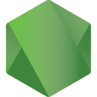

# 👋 Greetings, I’m Jack - aka EpictetusZ1

---

## 🔭 I'm a Front End Developer, who's just trying his best to center all the divs

- 🎓 I'm currently finishing up working through [The Odin Project][Odin] - A open source Full Stack Developer curriculum with over 5,000 contributors
- 🌱 I’m currently learning Next.js and a bit of Php
- 👀 I'm interested in learning: GraphQL, and Redis
- 👟 Fun fact: I love running, reading and playing chess!

### Find me on the world wide web:

### Be Sociable:

### Try Hack Me - A cyber security learning platform:

### Languages and Tools

#### Applications & Data:

#### DevOps:
 

#### Business Tools:

## GitHub Stats

[Odin]: https://www.theodinproject.com/
